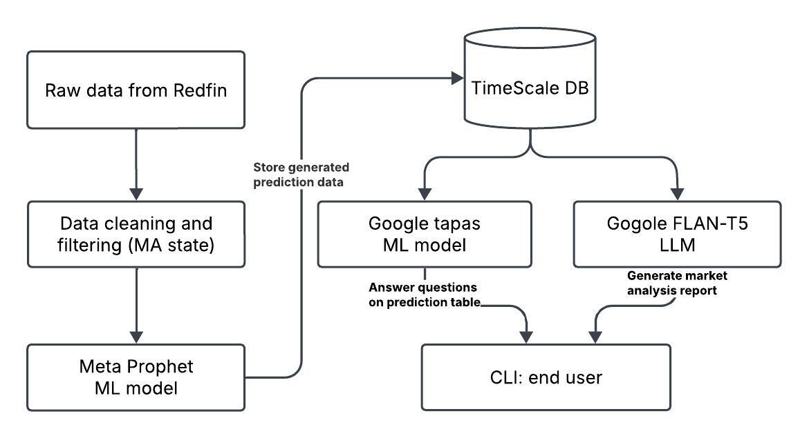

# HOUSING_MARKET_ANALYST_AI_AGENT

Welcome to the HOUSING_MARKET_ANALYST_AI_AGENT project! This project analyzes housing prices based on advanced AI techniques.

This project aims to forecast the 2025 housing market using a combination of data processing, machine learning models, and natural language processing. The system integrates data from Redfin, processes it, and utilizes various models to generate insights and reports.

## Project Overview

### 1. Data Collection and Cleaning
- **Source:** Raw data is collected from Redfin.
- **Cleaning and Filtering:** The data is cleaned and filtered to focus on the Massachusetts (MA) state. This involves:
  - Loading data from a TSV file.
  - Renaming and formatting columns.
  - Converting date columns to datetime format.
  - Deriving time features like year and quarter.
  - Filling missing values with the most recent available data.
  - Aggregating relevant metrics by zip code, year, and quarter.

### 2. Meta Prophet ML Model
- **Purpose:** Used for time series forecasting.
- **Functionality:** Generates prediction data for the 2025 housing market based on historical trends and patterns in the cleaned data.

### 3. Google TAPAS ML Model
- **Purpose:** Performs question answering on tabular data.
- **Functionality:** Takes the prediction data as input and answers user queries about the prediction table. This allows for interactive exploration of the forecast data.

### 4. Google FLAN-T5 LLM
- **Purpose:** Generates human-readable market analysis reports.
- **Functionality:** Converts the prediction data and insights into detailed natural language reports, making the information accessible and understandable to end users.

## User Interaction

- **CLI Interface:** End users interact with the system through a command-line interface, receiving answers and reports generated by the TAPAS and FLAN-T5 models.

## System Workflow

1. **Data Collection:** Gather raw data from Redfin.
2. **Data Cleaning:** Process and clean the data to ensure quality and relevance.
3. **Forecasting:** Use the Meta Prophet model to predict future market trends.
4. **Question Answering:** Employ the TAPAS model to answer questions about the forecast data.
5. **Report Generation:** Utilize the FLAN-T5 model to create comprehensive market analysis reports.
6. **User Interaction:** Provide insights and reports to users via the CLI.

## Getting Started

### Prerequisites:
- Python 3.x
- Required Python libraries: pandas, transformers, torch, etc.

## Setup Instructions

### Step 1: Clone the Repository
Clone the repository to your local machine using the following command:

```bash
git clone https://github.com/yourusername/your-repo-name.git
cd your-repo-name
```

### Step 2: Set Up a Virtual Environment
Create a virtual environment to isolate project dependencies.

- On **Windows**:

  ```bash
  python -m venv venv
  venv\Scripts\activate
  ```

- On **macOS/Linux**:

  ```bash
  python -m venv venv
  source venv/bin/activate
  ```

### Step 3: Install Dependencies
Install the required dependencies using the `requirements.txt` file:

```bash
pip install -r requirements.txt
```

### Step 4: Fine-tune the FLAN-T5 Model
Fine-tuning the FLAN-T5 model ensures it generates high-quality, domain-specific housing market reports tailored to your prompts and desired output format.

Run the script below to fine-tune the model:

```bash
python fine_tune_flan.py
```

### Step 5: Run the Project
Once your virtual environment is activated, dependencies are installed, and the model is fine-tuned, start the project by running:

```bash
python cli_interface.py
```

## System Design Diagram



## Example Outputs
Enter your query (or type 'exit' to quit):

```
Query: tell me What was the median price per square foot in zip code 2120 for 2025 Mar          
Answer: The median ppsf for zip code 2120 in March 2025 is $623.10.
```

```
Query: check for me Which month in 2025 had the highest sale price and lowest inventory in zip code 2120 
Answer: In 2025, October had the highest median sale price ($1436306.44) with an inventory level of 7.71.
```

```
Query: help me to generate a market analysis report for zip code 2120 for 2025

Market Analysis Report:
For 2025 in zip code 2120, the housing market has shown stability with an average price per square foot of approximately $245.00 and a median sale price of approximately $360,000. Summer months witnessed a spike in sale prices driven by low inventory. Looking ahead, analysts predict that the coming months will bring an uptick in new listings as market activity normalizes. This anticipated increase in supply is expected to relieve pricing pressure slightly, creating a more balanced market environment.
```

```
Query: generate a market analysis report for zip code 1344 for 2025    

Market Analysis Report:
The housing market in zip code 1344 has shown stability with an average price per square foot of $245.00 and a median sale price of $360,000. Market activity has shown stability with an average price per square foot of approximately $243.50 and a median sale price of approximately $370,000.
```

```
Query: create a market analysis report for zip code 1001 for 2025

Market Analysis Report:
In zip code 1001, the housing market remains robust with an average price per square foot of $243.46 and a median sale price of $349,479.89. Inventory was at its lowest in December, indicating strong buyer demand. Over the next two months, we expect new listings to gradually increase as sellers respond to seasonal market shifts. This anticipated rise in inventory could help stabilize prices further, offering potential opportunities for buyers to negotiate and for sellers to recalibrate their expectations.
```

## Future Development

The current raw data was downloaded from the Redfin website free for use. There are many missing data points, and the raw data was not well structured. If we can obtain high-quality data with detailed housing transactions and housing information — such as the number of bedrooms, square footage, lot size, heating type, and so on — this quality data will lead to a tremendous improvement in future housing market predictions.

Additionally, this project was developed on a MacBook Pro with 16GB DDR4 memory. The training and fine-tuning of the models require higher-performance hardware, such as powerful GPUs, for faster and more efficient processing.